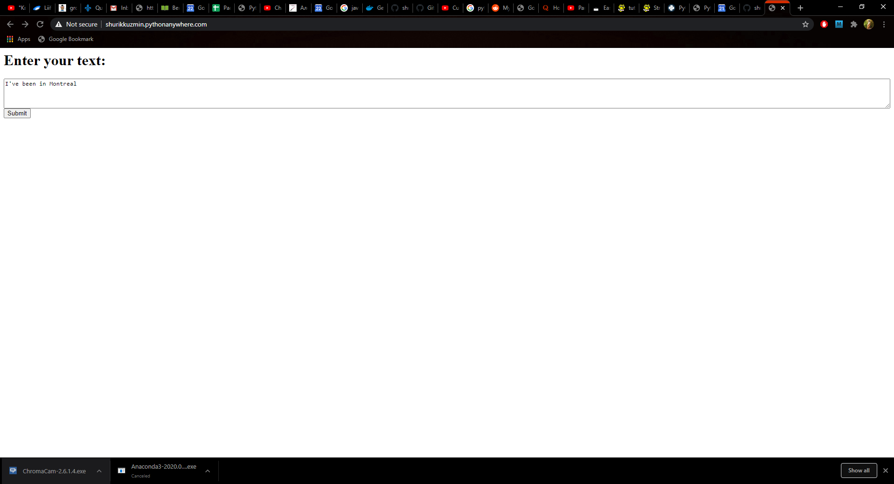
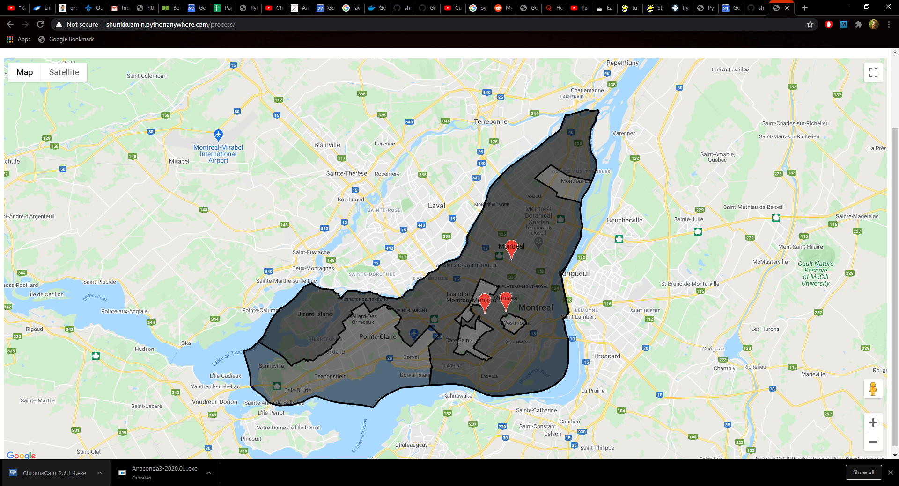

# Learn how to extract geographical names from the text, then to retrieve their polygon boundaries and represent them on Google Maps using Python 
The demo is available [here](http://shurikkuzmin.pythonanywhere.com)

